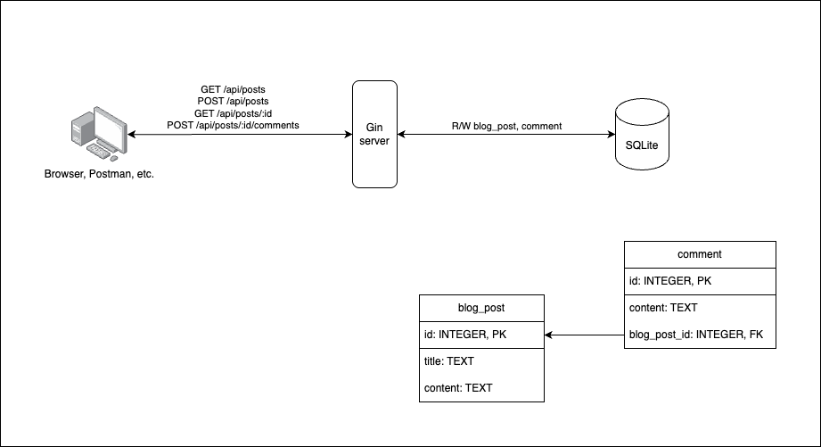

# blogging-example
Coding Challenge Solution

# How to run

Clone and CD into repo:

```bash
git clone git@github.com:youming-lin/blogging-example.git
cd blogging-example
```

Run main.go with DB connection:
```bash
export DB_URI=$(realpath data.sqlite) && go run main.go
```

By default the server runs at [http://localhost:8080/](http://localhost:8080/).

# How to use

Import [this file](docs/blogging-example.postman_collection.json) into Postman. You'll find examples for all four REST APIs in the `blogging-example` collection.

# Architecture diagram



# Additional work for real production app

1. Use a real database
2. Authentication and authorization
3. Dockerfile
4. Unit and integration tests
5. CI/CD pipelines
6. Performance testing
